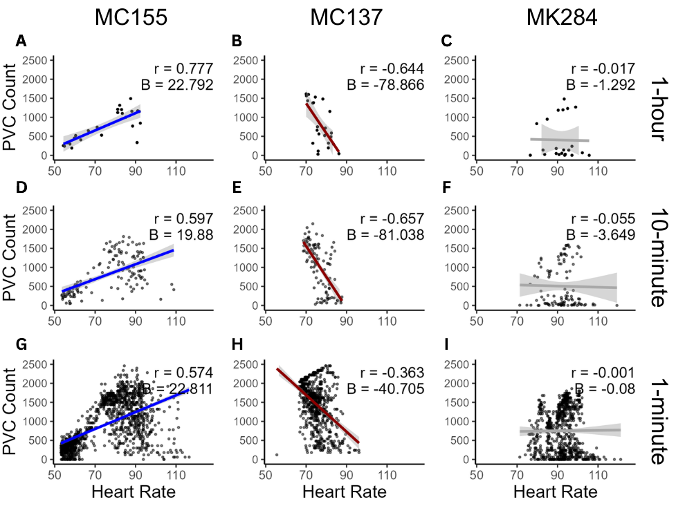

# Source Code for PVC-HR Analysis

### Study: *Dependence of premature ventricular complexes on heart rate — it's not that simple*

### Code Contributors: *Adrien Osakwe & Noah Wightman*
### Correspondence: *Adrien Osakwe, Leon Glass & Thomas M. Bury*

This repository contains the analysis scripts to reproduce the results from the above study. The analysis was run on 1-7 day ECG recordings from patients with a high burden of Premature-ventricular contractions (PVCs).

The results are generated using the [ECG_Figures.Rmd](./ECG_Figures.Rmd) notebook. The processing pipeline and analysis scripts called by the notebook can be found in the [Scripts folder](./Scripts).

## [See the preprint here](https://www.authorea.com/users/784793/articles/950015-dependence-of-premature-ventricular-complexes-on-heart-rate-it-s-not-that-simple?commit=5ef7ff43237255086a2e97df12b961a0563278cf)

